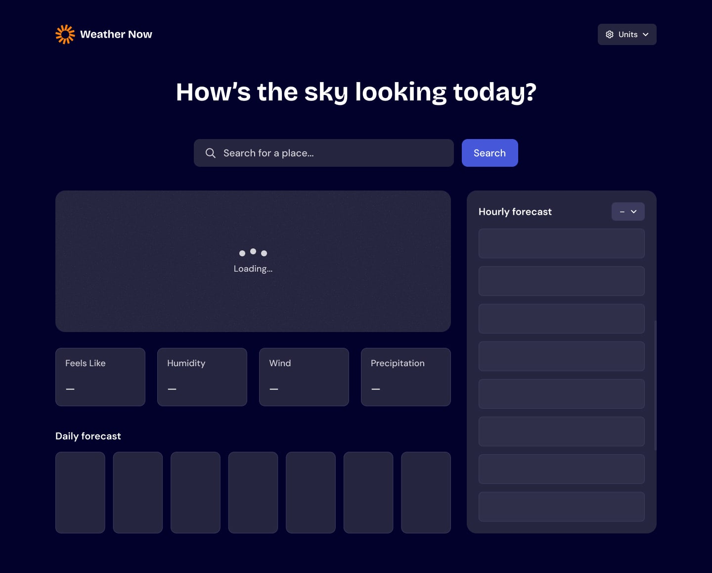

<!-- @format -->

# Weather App

A responsive weather application that allows users to search any city and view real-time weather data using the Open-Meteo API.

UI design inspired by Frontend Mentor

---

## Live Demo

https://olaniyan18.github.io/Weather-App/

---

## Preview




---

## Tech Stack

- React (Hooks: useState, useEffect)
- Axios (API requests)
- Open-Meteo Geocoding API
- Open-Meteo Weather API
- CSS Modules / Custom styling

---

## Features

- Search any city worldwide
- Geocoding for accurate locations
- Real-time weather data
- Current + hourly + daily forecasts
- Loading states for smooth UX
- Error handling for invalid searches
- Fully responsive UI

---

## How It Works

1. User enters a city name
2. App fetches coordinates using Open-Meteo Geocoding API
3. Coordinates are used to fetch weather data
4. Weather is displayed in structured UI components

---

## Project Structure

```bash
src/
├── components/
│   ├── First/
│   ├── Second/
│   ├── Third/
│   ├── Fourth/
│   ├── Fifth/
│   └── Error/
├── Weather.jsx
├── weather.module.css
```

## Installation & Setup

git clone https://github.com/your-username/weather-app.git
cd weather-app
npm install
npm start

## Error Handling

Empty input validation
City not found handling
API failure fallback UI

- Future Improvements
- Dark mode toggle
- Auto-detect user location
- Save recent searches
- Improved animations & transitions
- Unit toggle (°C / °F)

## Author

Built by Kafayah

Design inspired by Frontend Mentor
